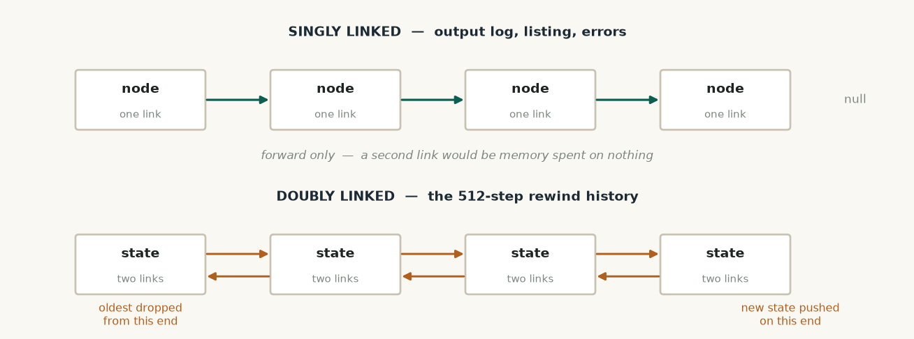

# Data Structures — what this code does

**Subject:** Programming Laboratory 2310214L
**Folder:** `src/ds/` — 765 lines, 5 files

Everything in this folder is a container we wrote ourselves. The project uses no
`std::stack`, `std::queue`, `std::list` or `std::map` anywhere. Each container also does
a real job inside the processor — none of them exist just to demonstrate a topic.

---

## The files

| File | Lines | What it is |
|---|---|---|
| `Stack.h` | 105 | Last-in-first-out store, built from linked nodes |
| `CircularQueue.h` | 93 | First-in-first-out queue on a fixed array that wraps |
| `Deque.h` | 148 | Double-ended queue on a doubly linked list |
| `LinkedList.h` | 153 | Singly linked list with sorting |
| `HashMap.h` | 266 | Hash table with three collision strategies |

---




*Singly linked for the log and listing; doubly linked for the rewind history, because states arrive at one end and are discarded from the other.*

## `Stack.h` — the CPU's call stack

Holds values in last-in-first-out order using linked nodes. Has an optional capacity, so
pushing past the limit raises an error instead of consuming memory silently.

**What it does in the project:** when the program runs `CALL`, the address to come back
to is pushed. When it runs `RET`, that address is popped and the processor jumps back.
`PUSH` and `POP` use the same stack for ordinary data.

```cpp
T pop() {
    if (top_ == 0) throw core::StackUnderflowException("pop on empty stack");
    Node* n = top_;
    T value = n->data;
    top_ = n->below;      // top moves down one
    delete n;
    --size_;
    return value;
}
```
<sub>src/ds/Stack.h:65</sub>

If a program returns without having called anything, the stack refuses and the simulator
reports a clear error rather than jumping to a garbage address.

---

## `CircularQueue.h` — the instruction fetch buffer

A queue built on one fixed array. Instead of shifting elements when something is removed,
it moves an index and wraps around using modulo.

**What it does in the project:** holds instructions read ahead of execution, so the
processor always has the next one ready.

```cpp
void enqueue(const T& value) {
    buf_[(front_ + count_) % capacity_] = value;   // % wraps at the end
    ++count_;
}

T dequeue() {
    T value = buf_[front_];
    front_ = (front_ + 1) % capacity_;             // % wraps at the end
    --count_;
    return value;
}
```
<sub>src/ds/CircularQueue.h:52</sub>

Nothing is ever moved or reallocated — the same array is reused indefinitely. This is
also what the round-robin scheduling demonstration runs on.

---

## `Deque.h` — the step-backward history

A queue that is open at both ends, built on a doubly linked list so each node knows both
its neighbours.

**What it does in the project:** stores the last 512 machine states. Each step pushes a
new state at the back; when it is full, the oldest is dropped from the front. Because
both ends are reachable, execution can be rewound.

```cpp
void pushBack(const T& value) {
    Node* n = new Node(value);
    n->prev = tail_;                    // links both ways
    if (tail_) tail_->next = n; else head_ = n;
    tail_ = n;
    ++size_;
}
```
<sub>src/ds/Deque.h:79</sub>

It also supports restricted modes, where one end is deliberately blocked:

```cpp
void pushFront(const T& value) {
    if (mode_ == DEQUE_INPUT_RESTRICTED)
        throw core::SimulatorException("pushFront blocked: input-restricted deque");
    ...
}
```
<sub>src/ds/Deque.h:68</sub>

---

## `LinkedList.h` — growing lists, and sorting

A singly linked list: each node points only forwards. Used wherever the number of items
cannot be known in advance.

**What it does in the project:** holds the assembler's error messages, the assembled
program listing, the output log, and the chains inside each hash bucket.

It also sorts itself — insertion sort performed by **relinking nodes**, not by moving
data:

```cpp
template <typename Compare>
void sort(Compare less) {
    Node* sorted = 0;
    Node* cur    = head_;
    while (cur != 0) {
        Node* next = cur->next;
        if (sorted == 0 || less(cur->data, sorted->data)) {
            cur->next = sorted;  sorted = cur;         // goes at the front
        } else {
            Node* s = sorted;
            while (s->next != 0 && !less(cur->data, s->next->data)) s = s->next;
            cur->next = s->next;  s->next = cur;       // insert in the middle
        }
        cur = next;
    }
    head_ = sorted;
}
```
<sub>src/ds/LinkedList.h:98</sub>

This is what puts the memory dump in address order before it is displayed — without it,
cells appear in hash-bucket order, which reads as noise.

---

## `HashMap.h` — fast lookup, and sparse storage

The largest structure in the project. Maps a key to a value in roughly constant time, and
supports all three collision-handling methods, chosen when the table is created.

**Two jobs in the project:**

1. **The assembler's symbol table.** When you write `loop:` in a program and later write
   `JNZ loop`, this is what remembers that `loop` means line 3.

2. **Sparse memory.** The address space is 64K words but a program touches maybe five
   cells. Only written cells are stored; anything else reads as zero.

```cpp
// all three strategies, selected at construction
size_t probeIndex(size_t home, size_t i) const {
    if (strategy_ == QUADRATIC_PROBING) return (home + i * i) % buckets_;
    return (home + i) % buckets_;              // linear probing
}

// separate chaining — a linked list per bucket
Entry* e = new Entry(key, value);
e->next = table_[home];
table_[home] = e;
```
<sub>src/ds/HashMap.h:222</sub>

Deleting under open addressing leaves a tombstone rather than an empty slot, so probe
chains are not broken:

```cpp
e->occupied = false;
e->deleted  = true;      // keeps the probe chain intact
```
<sub>src/ds/HashMap.h:168</sub>

---

## How it fits together

```
Stack          →  CALL / RET / PUSH / POP        (src/core/Instruction.cpp)
CircularQueue  →  instruction fetch buffer        (src/core/CPU.cpp)
Deque          →  512-step rewind history         (src/core/CPU.h)
LinkedList     →  output log, listing, errors     (src/core/CPU.h, src/asm/Assembler.h)
                  and the chains inside HashMap
HashMap        →  symbol table                    (src/asm/Assembler.h)
                  sparse memory                   (src/core/Memory.h)
```

Every one of these is on the live path — remove any of them and the processor stops
working.

---

## Practicals this covers

P2 (sparse), P3 (singly linked), P4 (doubly linked), P6 (stack), P8 (circular queue),
P9 (deque), P10 (sorting), P11 (hashing — all three strategies).

Still to do: P1 and P5 need their named application screens, P7 needs the recursion demo.
