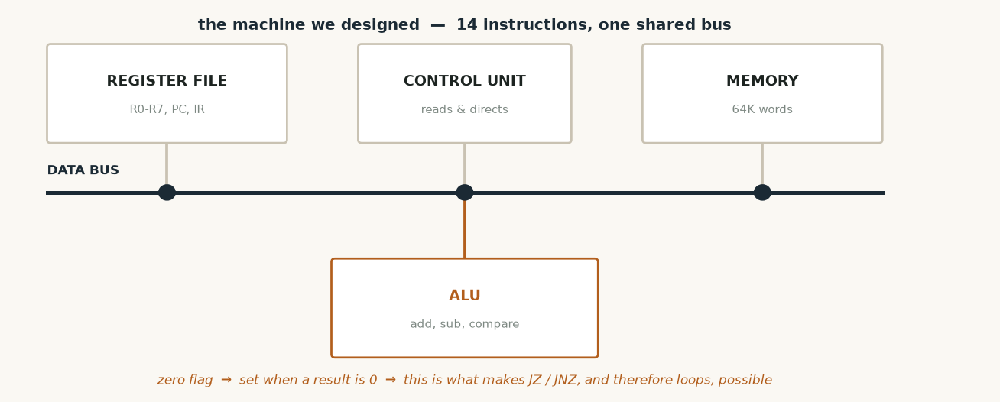
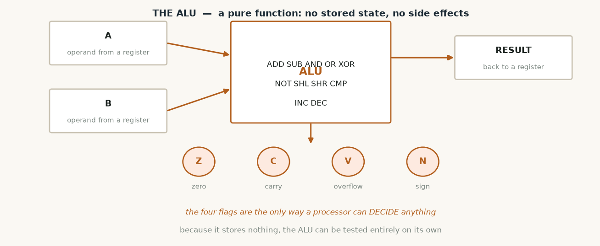
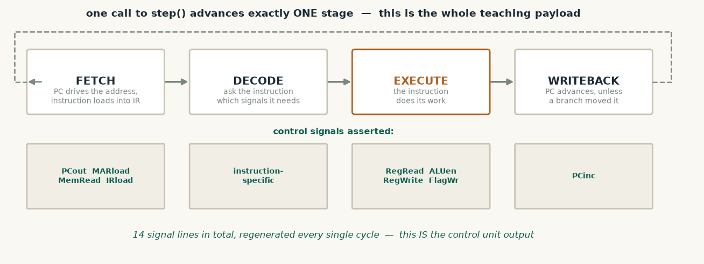
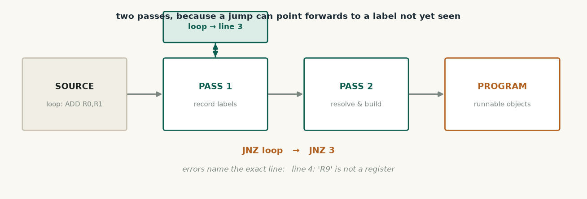

# Computer Organisation & Architecture — what this code does

**Subject:** COA Laboratory 2310221L
**Folders:** `src/core/` (1,764 lines) and `src/asm/` (387 lines)

This is not a subject applied to the project — it is the thing the project simulates.
Every component a COA textbook draws as a box exists here as a class with the same
responsibility it has in real hardware.

---

## The files

| File | Lines | What it is |
|---|---|---|
| `core/Word.h` / `.cpp` | 119 | The 16-bit value everything moves around |
| `core/RegisterFile.h` / `.cpp` | 178 | R0–R7, PC, IR, SP, MAR, MDR and the flags |
| `core/ALU.h` / `.cpp` | 260 | The arithmetic and logic unit |
| `core/Instruction.h` / `.cpp` | 675 | 15 instruction classes + the control signals |
| `core/Memory.h` / `.cpp` | 121 | Addressable storage, sparsely held |
| `core/CPU.h` / `.cpp` | 333 | The datapath — runs one micro-step per call |
| `asm/Assembler.h` / `.cpp` | 387 | Turns text into runnable instructions |

---




*The machine we designed: register file, control unit and memory on one shared bus, with the ALU beneath it.*

## `Word.h` — the machine word

A 16-bit value with all the operators a processor needs, so ALU code reads like
arithmetic instead of function calls.

```cpp
Word operator+(const Word& o) const { return Word((u16)(value_ + o.value_)); }
bool msb() const { return bit(BITS - 1); }     // the sign bit
std::string toBinary(int width = BITS) const;  // for the register display
```

It also knows how to print itself as binary, hexadecimal, unsigned decimal and signed
decimal — which is what lets the interface switch number bases.

---

## `RegisterFile.h` — the registers

Holds the eight general registers plus the special ones a processor needs:

| Register | Purpose |
|---|---|
| R0–R7 | General purpose |
| PC | Program counter — which instruction is next |
| IR | Instruction register — the one being executed |
| SP | Stack pointer |
| MAR / MDR | Memory address and data registers |

Each register also records whether it was **read or written during this cycle**:

```cpp
Word read()        { readThisCycle_ = true;  return value_; }
void write(Word v) { value_ = v; wroteThisCycle_ = true; }
```

That is what lets the display highlight exactly which registers took part in the current
instruction. Without it the diagram could show values but not activity.

Flags live here too — Zero, Carry, Overflow and Negative, printed as `Z-V-` style text.

---




*The ALU is a pure function: two operands in, a result and four flags out. The flags are the only way a processor can decide anything.*

## `ALU.h` / `ALU.cpp` — the calculator

Performs ADD, SUB, AND, OR, XOR, NOT, SHL, SHR, CMP, INC and DEC, returning a result
**and** the four flags.

It holds no state at all — the same inputs always give the same outputs:

```cpp
AluResult ALU::execute(AluOp op, Word a, Word b);
```

That purity is deliberate: it means the ALU can be tested on its own, with no processor
around it.

**How the flags are worked out**

Carry is the bit that falls out of the top. We add in a 32-bit scratch value and test
bit 16:

```cpp
wide = (u32)a.raw() + (u32)b.raw();
res.flags.carry = (wide & 0x10000u) != 0;
```

Signed overflow is a different question — it happens when both operands share a sign but
the result does not:

```cpp
bool ALU::computeOverflowAdd(Word a, Word b, Word r) {
    return (a.msb() == b.msb()) && (r.msb() != a.msb());
}
```

**Multiplication** is also here, done two ways so they can be compared — add-and-shift,
and successive addition. Both return a printable trace:

```cpp
static Word multiplyAddShift(Word a, Word b, std::string* trace);
static Word multiplySuccessiveAdd(Word a, Word b, std::string* trace);
```

Running both on 13 × 7 and getting 91 from each is also a correctness check.

---

## `Instruction.h` / `.cpp` — the instruction set and control signals

Fifteen instruction classes, all deriving from one abstract base. Each knows two things:
how to execute itself, and which control signals it needs.

```cpp
class Instruction {
public:
    virtual void           execute(CPU& cpu) = 0;
    virtual ControlSignals signals() const   = 0;
};
```

**The control signals** are the control unit's entire output — fourteen lines,
regenerated every cycle:

```
PCout  PCload  PCinc  MARload  MemRead  MemWrite  IRload
RegRead  RegWrite  ALUen  FlagWr  StackOp  BusAct  Halt
```

Each instruction returns its own vector. For example an ADD asserts:

```cpp
ControlSignals AluBinaryInstruction::signals() const {
    ControlSignals s;
    s.regRead   = true;
    s.regWrite  = (op_ != ALU_CMP);   // CMP computes flags but writes nothing
    s.aluEnable = true;
    s.aluOp     = op_;
    s.flagWrite = true;
    s.busActive = true;
    s.pcInc     = true;
    return s;
}
```

Because those signals already exist, plotting them as a timing chart later requires no
new machinery — only a view.

---

## `Memory.h` / `.cpp` — storage

64K addressable words, but stored sparsely: only cells that were actually written take
up space, and anything unwritten reads as zero.

```cpp
class Memory {
    ds::HashMap<unsigned int, u16> cells_;   // address -> value
};
```

It also tracks the last address touched and whether it was a read or a write, so the
diagram can show memory activity.

---




*One call to step() advances exactly one stage, and each stage asserts its own control signals — fourteen lines in total, regenerated every cycle.*

## `CPU.h` / `.cpp` — the datapath

The part that ties everything together. One call to `step()` advances **exactly one
micro-stage**:

```cpp
case STAGE_FETCH:      // PC drives the address, instruction loads into IR
case STAGE_DECODE:     // ask the instruction for its control signals
case STAGE_EXECUTE:    // current_->execute(*this)   <- polymorphic
case STAGE_WRITEBACK:  // PC advances, unless a branch already moved it
```

That is what turns a memorised four-word sequence into something you can watch happen.

The CPU also owns the call stack (`ds::Stack<Word>`), the cycle history
(`ds::Deque<CycleRecord>`) and the output log — recording a full snapshot every cycle so
execution can be rewound.

---




*Two passes, because a jump can point forwards to a label that has not been seen yet.*

## `asm/Assembler.h` / `.cpp` — text into instructions

A two-pass assembler.

**Pass one** walks the source and records where every label is:

```cpp
if (colon != std::string::npos) {
    std::string label = trim(t.substr(0, colon));
    if (!label.empty()) symbols_.put(label, address);
}
```

**Pass two** builds the instruction objects and resolves label references, so `JNZ loop`
becomes a jump to line 3.

It accepts comments, labels, flexible spacing, and decimal, hexadecimal or binary
literals. Errors name the exact line:

```
line 4: 'R9' is not a register (use R0 to R7)
```

---

## The instruction set

Fourteen instructions, enough for real programs with loops and decisions:

```
LOAD  Rd, #n       put a literal into a register
LOADM Rd, [addr]   read from memory
STORE Rs, [addr]   write to memory
MOV   Rd, Rs       copy register to register
ADD / SUB / AND / OR / XOR  Rd, Rs
CMP   Rd, Rs       compare — sets flags, writes nothing
NOT / SHL / SHR / INC / DEC  Rd
MUL   Rd, Rs       add-and-shift multiply
JMP / JZ / JNZ / JC / JNC / JN  addr
CALL addr  /  RET  subroutines, using the stack
PUSH Rs  /  POP Rd
OUT   Rs           print a register
HLT                stop
```

---

## Sample programs

`programs/` holds three working programs, all verified:

| File | What it does | Result |
|---|---|---|
| `sum.asm` | Adds 1 to 10 with a counted loop | 55 ✓ |
| `multiply.asm` | 13 × 7 both by add-and-shift and by repeated addition | 91 from both ✓ |
| `subroutine.asm` | CALL / RET and PUSH / POP | 10, 42, 42 ✓ |

---

## Practicals this covers

P1 (ALU) and P2 (control unit) are the core of the project.

Still to do: P3–P5 need 64-bit wide arithmetic, P4 needs hex↔BCD conversion, P6 needs
string operations, P7 needs floating point for quadratic roots. Pipelining with visible
hazard stalls is the other large remaining piece.
