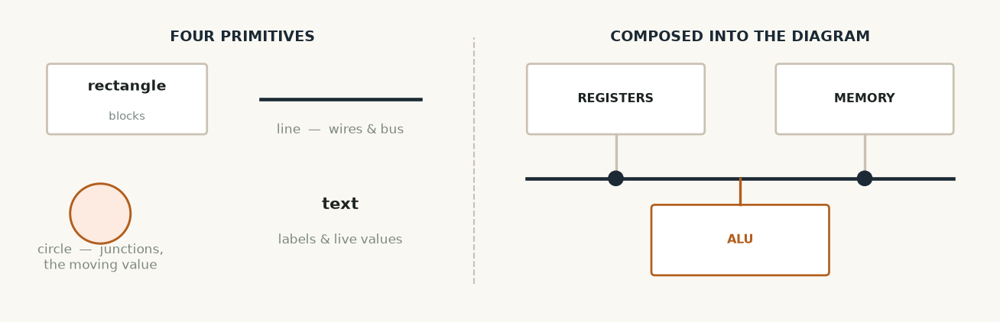
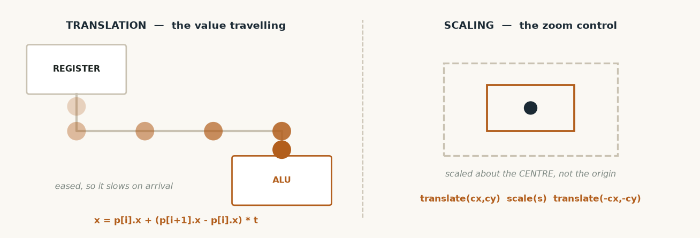

# Computer Graphics — what this code does

**Subject:** Computer Graphics Laboratory 2310218L
**Folder:** `src/ui/` — 835 lines, 4 files

The whole point of this project is to make hidden machinery visible, so the drawing code
is not decoration added at the end — it is the deliverable. Nothing here calls a
ready-made "draw a line" function. A screen is only a grid of dots; something has to
decide which dots to light, and that decision is what this folder contains.

---

## The files

| File | Lines | What it is |
|---|---|---|
| `Canvas.h` | 104 | The drawing surface and the list of algorithms |
| `Canvas.cpp` | 366 | Bresenham, DDA, scan-line fill, flood fill, clipping |
| `ConsoleView.h` | 50 | The panes that make up the display |
| `ConsoleView.cpp` | 315 | Uses the Canvas to draw the datapath and waveform |

---




*Four primitives — rectangle, line, circle and text — composed into the whole interface.*

## `Canvas` — a pixel buffer we own

The Canvas is a plain array of pixels with a width and a height. Every drawing routine
writes into it; nothing writes to the screen directly.

```cpp
class Canvas {
    int    width_, height_;
    Pixel* buffer_;             // one big array
};

void Canvas::setPixel(int x, int y, Pixel p) {
    if (inBounds(x, y)) buffer_[y * width_ + x] = p;
}
```
<sub>src/ui/Canvas.h (members) and src/ui/Canvas.cpp:44 (setPixel)</sub>

**Why this matters:** at the moment `render()` prints the buffer as characters in a
terminal. Swapping to an SDL2 or OpenGL window means rewriting only that one function —
not a single line of any algorithm below. That separation is why the remaining graphics
work is cheap.

---

## Bresenham's line — every wire in the diagram

Draws a straight line using integers only. An error term tracks how far the true line has
drifted from the pixel grid, so there is no floating point and no rounding.

```cpp
void Canvas::drawLineBresenham(int x0, int y0, int x1, int y1, Pixel p) {
    int dx =  std::abs(x1 - x0);
    int dy = -std::abs(y1 - y0);
    int sx = (x0 < x1) ? 1 : -1;
    int sy = (y0 < y1) ? 1 : -1;
    int err = dx + dy;

    for (;;) {
        setPixel(x0, y0, p);
        if (x0 == x1 && y0 == y1) break;
        int e2 = 2 * err;
        if (e2 >= dy) { err += dy; x0 += sx; }
        if (e2 <= dx) { err += dx; y0 += sy; }
    }
}
```
<sub>src/ui/Canvas.cpp:56</sub>

**What it draws:** the shared data bus, and every wire dropping from a component onto it.

The same routine draws a wire whether it is idle or carrying data — only the pixel value
changes (`#` when active, `.` when idle). That is how the datapath appears to light up as
you step through a program.

---

## Bresenham's circle — the bus junctions

Draws a circle by computing **one eighth** of it and mirroring that arc into the other
seven octants, because a circle is symmetric. Seven eighths of the work is avoided.

```cpp
while (y >= x) {
    // eight-way symmetry
    setPixel(cx + x, cy + y, p);
    setPixel(cx - x, cy + y, p);
    setPixel(cx + x, cy - y, p);
    setPixel(cx - x, cy - y, p);
    setPixel(cx + y, cy + x, p);
    setPixel(cx - y, cy + x, p);
    setPixel(cx + y, cy - x, p);
    setPixel(cx - y, cy - x, p);

    ++x;
    if (d > 0) { --y; d = d + 4 * (x - y) + 10; }
    else       {      d = d + 4 * x + 6; }
}
```
<sub>src/ui/Canvas.cpp:107</sub>

---

## DDA line — kept for comparison

The other classic line algorithm, using floating-point increments and rounding each step.
It is not used for the diagram; it exists so the two approaches can be compared directly
rather than described.

```cpp
double xInc = static_cast<double>(dx) / steps;
double yInc = static_cast<double>(dy) / steps;
double x = x0, y = y0;

for (int i = 0; i <= steps; ++i) {
    setPixel(static_cast<int>(x + 0.5), static_cast<int>(y + 0.5), p);
    x += xInc;
    y += yInc;
}
```
<sub>src/ui/Canvas.cpp:84</sub>

---

## Scan-line polygon fill — filling the component blocks

Works one horizontal row at a time. For each row it finds where that row crosses the
polygon's edges, sorts those crossings, and fills between consecutive pairs.

```cpp
for (int y = yMin; y <= yMax; ++y) {
    int n = 0;
    for (int i = 0; i < count; ++i) {
        const Point& a = pts[i];
        const Point& b = pts[(i + 1) % count];
        if (a.y == b.y) continue;                     // skip horizontal edges
        int lo = (a.y < b.y) ? a.y : b.y;
        int hi = (a.y < b.y) ? b.y : a.y;
        if (y >= lo && y < hi) {                      // half-open, so shared
            int x = a.x + (b.x - a.x) * (y - a.y) / (b.y - a.y);
            xs[n++] = x;                              // vertices are not
        }                                             // counted twice
    }
    // insertion sort the crossings, then fill between pairs
}
```
<sub>src/ui/Canvas.cpp:227</sub>

The half-open rule (`y >= lo && y < hi`) is the detail that stops shared vertices being
counted twice, which would otherwise leave gaps in the fill.

---

## Boundary fill and flood fill

Region filling from a seed point. Both are written **iteratively with an explicit stack**
rather than recursively:

```cpp
int* stackX = new int[cap];
int* stackY = new int[cap];
int  top = 0;
stackX[top] = x; stackY[top] = y; ++top;

while (top > 0) {
    --top;
    int cx = stackX[top], cy = stackY[top];
    ...
    setPixel(cx, cy, fill);
    // push the four neighbours
}
```
<sub>src/ui/Canvas.cpp:269</sub>

The textbook version recurses, which on a large region exhausts the call stack. Using our
own stack array avoids that — a practical concern the recursive form hides.

---




*Translation carries the value along a waypoint route; scaling is applied about the centre of the diagram so zoom expands from the middle.*

## Cohen–Sutherland clipping — cutting wires at the edge

When the diagram is panned or zoomed, wires run off the visible area. Clipping cuts them
cleanly at the border instead of letting them wrap around.

Each endpoint gets a four-bit region code — one bit each for left, right, below, above:

```cpp
if (x < win.xmin)      c |= 1;   // LEFT
else if (x > win.xmax) c |= 2;   // RIGHT
if (y < win.ymin)      c |= 4;   // BOTTOM
else if (y > win.ymax) c |= 8;   // TOP
```
<sub>src/ui/Canvas.cpp:147</sub>

Then three cases:

```cpp
if ((c0 | c1) == 0) return true;    // both inside  -> accept
if ((c0 & c1) != 0) return false;   // both outside the same edge -> reject
// otherwise push the outside endpoint onto the boundary and try again
```
<sub>src/ui/Canvas.cpp:159</sub>

The bitwise AND test is the clever part: if both endpoints share an outside region, the
line cannot possibly cross the window, so it is thrown away without any arithmetic.

---

## `ConsoleView` — putting it together

Uses the Canvas to draw the actual displays:

**The datapath diagram** — component boxes, the shared bus, the drop wires, and junction
dots, with active parts drawn differently:

```cpp
Pixel busPix = sig.busActive ? PX_ACTIVE : PX_WIRE;
...
c.drawLineBresenham(2, busY, W - 3, busY, busPix);
```
<sub>src/ui/ConsoleView.cpp:63 and :103</sub>

The flag feedback wire from the ALU back to the control unit is drawn **through the
clipper**, so panning and zooming behave correctly:

```cpp
ClipWindow win(0, 0, W - 1, H - 1);
c.clipAndDrawLine(44, 16, 47, 16, win, flagPix);
```
<sub>src/ui/ConsoleView.cpp:142</sub>

**The waveform view** — the logic-analyzer display. One row per control signal, one
column per clock cycle, with rising and falling edges marked:

```
PCout     _/\__/\__/\__/\__/\__/\_
PCload    ______________/-\_______
MemWrite  __________________/-\___
stage     FDEWFDEWFDEWFDEWFDEWFDEW
```

`/` is a rising edge, `\` falling, `-` held high, `_` held low.

---

## In the web version

`web/index.html` mirrors the same ideas in the browser: the value travelling along the
bus is a **translation** interpolated along a waypoint path, and the zoom control is a
**scale** applied about the diagram's centre rather than the origin:

```js
scene.setAttribute("transform",
    "translate(380,205) scale(" + s + ") translate(-380,-205)");
```

---

## Practicals this covers

P2 (Bresenham line and circle, plus DDA), P3 (scan-line, boundary and flood fill),
P5 (Cohen–Sutherland clipping).

Still to do: P1, P4 and P6 need the OpenGL path — a triangle drawn with real OpenGL, a
spinning 3D cube, and texture mapping.
