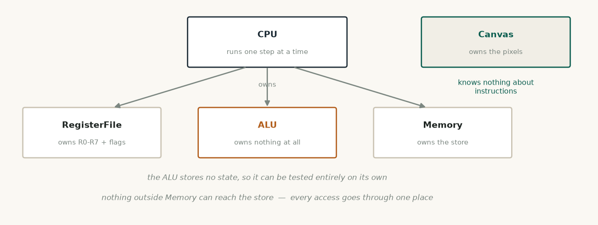
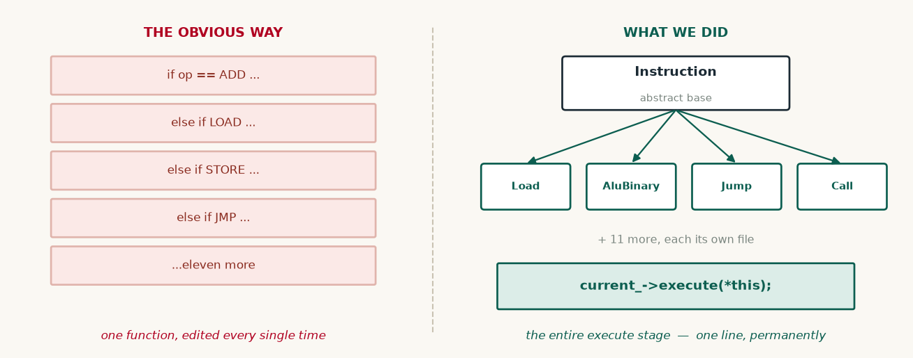

# Object-Oriented C++ — what this code does

**Subject:** Problem Solving using Object-Oriented Programming 2310261L
**Folder:** all of it — 4,102 lines across 28 files

This subject has no folder of its own, because the whole project is the deliverable. What
matters is that the object-oriented parts are **load-bearing**: take them out and the
design does not hold together. None of it is demonstration code sitting to one side.

---

## The decision that shaped everything

Our processor understands fifteen instructions, each doing something different.

**The obvious way** is one long chain of tests inside the processor:

**What this does.** The approach we deliberately did not take: fourteen branches inside one function, which would have to be edited every time an instruction was added.

```cpp
if      (op == "ADD")   { /* ... */ }
else if (op == "LOAD")  { /* ... */ }
else if (op == "JMP")   { /* ... */ }
// ...fifteen branches, growing with every new instruction
```
<sub>illustration of the approach we rejected — this is NOT in our source</sub>

**What we did instead** — one abstract base, and a small class per instruction:

**What this does.** What we wrote instead. We declare what every instruction must be able to do, and let each one supply its own version.

```cpp
// src/core/Instruction.h
class Instruction {
public:
    virtual ~Instruction() {}
    virtual void           execute(CPU& cpu) = 0;   // every instruction fills this in
    virtual ControlSignals signals() const   = 0;
};
```
<sub>src/core/Instruction.h:65</sub>

And then the entire execute stage of the processor is one line:

**What this does.** The entire execute stage of the processor. It asks the instruction to run itself and never checks which instruction it is holding.

```cpp
// src/core/CPU.cpp
current_->execute(*this);      // no idea, and no need to know, which instruction
```
<sub>src/core/CPU.cpp:163</sub>

**What this buys:** adding a new instruction means writing one new class and changing
nothing at all inside the CPU. With the branch chain, every addition edits the same
growing function — the one place most likely to break.

---




*Each class owns its own state. The ALU owns nothing at all, which is why it can be tested entirely on its own.*

## The class hierarchy

```
Instruction (abstract)
├── NopInstruction
├── HaltInstruction
├── LoadImmediateInstruction
├── LoadMemoryInstruction
├── StoreInstruction
├── MoveInstruction
├── AluBinaryInstruction      ADD, SUB, AND, OR, XOR, CMP
├── AluUnaryInstruction       NOT, SHL, SHR, INC, DEC
├── JumpInstruction           JMP, JZ, JNZ, JC, JNC, JN
├── CallInstruction
├── ReturnInstruction
├── PushInstruction
├── PopInstruction
├── OutInstruction
└── MultiplyInstruction
```

Note that `AluBinaryInstruction` covers six operations and `JumpInstruction` six
conditions — the difference is data held in the object, not a separate class each. That
is a deliberate judgement about where inheritance stops being useful.

---




*A fourteen-branch conditional against one class per instruction. The right-hand design leaves the processor untouched when an instruction is added.*

## Templates — write once, use for anything

Every container in `src/ds/` is a template, so one implementation serves every type it is
needed for.

**What this does.** The five containers, each written once and usable with any type the project needs.

```cpp
template <typename T> class Stack;             // src/ds/Stack.h:23
template <typename T> class LinkedList;        // src/ds/LinkedList.h:16
template <typename T> class Deque;             // src/ds/Deque.h:31
template <typename T> class CircularQueue;     // src/ds/CircularQueue.h:22
template <typename K, typename V, typename H = Hasher<K> > class HashMap;
```
<sub>the five container templates, one line each — declarations only</sub>

The same `Stack<T>` is used as:

**What this does.** The same Stack template holding machine words for the call stack. Elsewhere the very same code holds characters for the expression evaluator.

```cpp
ds::Stack<Word>          callStack_;    // CALL / RET and PUSH / POP
```
<sub>src/core/CPU.h:58 — the same template also serves Stack&lt;char&gt; in the evaluator</sub>

One piece of code, used safely for two unrelated types, checked by the compiler each
time.

---

## Operator overloading — making arithmetic read like arithmetic

`src/core/Word.h` teaches the 16-bit machine word to behave like a number:

**What this does.** Every operator we taught the machine word, so that ALU code reads like arithmetic rather than a chain of function calls.

```cpp
Word  operator+ (const Word& o) const;
Word  operator- (const Word& o) const;
Word  operator& (const Word& o) const;
Word  operator| (const Word& o) const;
Word  operator^ (const Word& o) const;
Word  operator~ () const;
Word  operator<<(int n) const;
Word  operator>>(int n) const;
Word& operator++();          // pre-increment
Word  operator++(int);       // post-increment
bool  operator==(const Word& o) const;
operator u16() const;        // conversion operator
```

Plus stream insertion, so a register can be printed directly:

**What this does.** Lets a register be printed straight to a stream, which is what the register display uses.

```cpp
std::ostream& operator<<(std::ostream& os, const Word& w);
```
<sub>src/core/Word.h:92</sub>

**Why:** the ALU reads as `a + b` rather than `add16(a, b)`. Easier to read, and easier
to check for mistakes.

---

## Exceptions — failing safely

`src/core/Exceptions.h` defines a small hierarchy, all deriving from one base:

**What this does.** One base type for every error the simulator can raise. Each specific problem inherits from it and reports its own name.

```cpp
class SimulatorException : public std::exception {
protected:
    std::string message_;
public:
    virtual const char* what() const throw() { return message_.c_str(); }
    virtual std::string kind() const { return "SimulatorException"; }
};
```
<sub>src/core/Exceptions.h:16</sub>

With specific types beneath it:

```
SimulatorException
├── InvalidOpcodeException
├── StackUnderflowException
├── StackOverflowException
├── IndexOutOfRangeException
├── InvalidRegisterException
├── AssemblyErrorException
└── DivideByZeroException
```

The main loop catches the **base** once, and gets the specific type through `kind()`:

**What this does.** Caught once, here. A bad instruction or an unbalanced RET prints a clear message with a line number instead of crashing the simulator.

```cpp
// src/main.cpp
catch (const SimulatorException& e) {
    std::cout << "  [" << e.kind() << "] " << e.what() << "\n";
}
```
<sub>src/main.cpp:342</sub>

So a typo in a program produces:

```
[AssemblyErrorException] Assembly error: line 4: 'R9' is not a register
```

instead of crashing the simulator.

---

## Dynamic memory — allocated and freed by hand

Every node in every container is created and destroyed by our own code. Each destructor
walks its own chain:

**What this does.** Every node we created is freed by us. The destructor walks its own chain and deletes as it goes.

```cpp
// src/ds/LinkedList.h
void clear() {
    Node* n = head_;
    while (n != 0) { Node* nx = n->next; delete n; n = nx; }
    head_ = tail_ = 0;
    size_ = 0;
}
```
<sub>src/ds/Deque.h:129</sub>

Copy constructors deep-copy, so two structures never share a node:

**What this does.** Copying a list builds fresh nodes rather than sharing the originals, so two lists can never interfere with one another.

```cpp
LinkedList(const LinkedList& other) : head_(0), tail_(0), size_(0) {
    for (Node* n = other.head_; n != 0; n = n->next) pushBack(n->data);
}
```
<sub>src/ds/LinkedList.h:32</sub>

The Canvas allocates its pixel buffer the same way, and the CPU owns and frees the loaded
program array.

---

## Encapsulation — who owns what

Each class owns its data and nothing outside can reach it directly:

| Class | Owns | Responsible for |
|---|---|---|
| `RegisterFile` | The registers and flags | Reading, writing, and reporting what changed |
| `ALU` | Nothing — no state at all | Given an operation and two values, return a result and flags |
| `Memory` | The addressable store | Reads and writes by address, and nothing else |
| `CPU` | Registers, ALU, memory, program | Running one micro-step and keeping state consistent |
| `Canvas` | The pixel buffer | Turning coordinates into pixels |

The ALU knows nothing about instructions. The Canvas knows nothing about processors. The
CPU knows nothing about drawing. That is why the console interface could be replaced with
a graphical one without touching the engine.

---

## Static, inline, const

Small things used throughout:

**What this does.** Small helpers that belong to the class but need no object to call them.

```cpp
// static — a helper that needs no object
static std::string gpName(int index);
static int         gpIndexFromName(const std::string& name);
static bool        computeOverflowAdd(Word a, Word b, Word r);

// inline accessors on the hot path
Word peek() const { return value_; }
bool msb()  const { return bit(BITS - 1); }

// const-correctness so the UI cannot accidentally mutate the machine
const RegisterFile& registers() const { return regs_; }
```
<sub>src/core/RegisterFile.h:69</sub>

---

## Why each choice was made

| Without it | The consequence |
|---|---|
| Inheritance and polymorphism | A fifteen-branch conditional inside the CPU, edited on every addition |
| Templates | The same stack written twice — once for words, once for characters |
| Exceptions | A typo crashes the simulator instead of reporting a line number |
| Operator overloading | ALU code written as nested function calls, harder to verify |
| Encapsulation | The UI could corrupt machine state directly |

---

## Practicals this covers

All twelve, distributed across the codebase:

| Practical | Where |
|---|---|
| P1, P2 — classes, constructors, destructors | `RegisterFile`, `ALU`, `Memory`, `CPU`, `Canvas` |
| P3 — operator overloading | `Word.h` |
| P4 — dynamic memory, pointers, references | every file in `src/ds/`, `Canvas.cpp` |
| P5 — this, inline, static, friend | `RegisterFile.cpp`, `ALU.cpp` |
| P6 — inheritance | `Instruction.h` — 15 classes from one base |
| P7 — polymorphism | `CPU.cpp` — `current_->execute(*this)` |
| P8 — exception handling | `Exceptions.h`, caught in `main.cpp` |
| P9 — std::move | transferring the assembled program into the CPU |
| P10 — templates | all five containers in `src/ds/` |
| P11 — STL | `std::vector` used alongside our own containers |
| P12 — type casting | conversion operator on `Word`, casts in decode |

---

**Note:** the official course-outcome wording for 2310261L should be confirmed against
the syllabus. The mapping of work to concepts above is unaffected either way.
